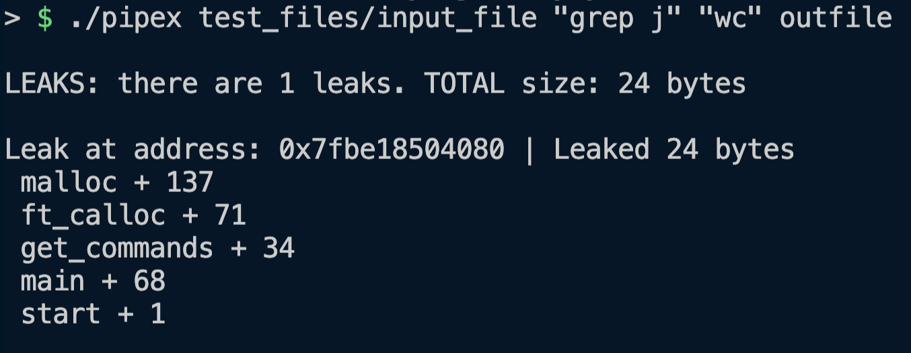

# Simple memory leak checker for 42 students

This repo contains some simple but very helpful tools for debugging your code.

## Current debug functions

`check_leaks()`
> NOW NORMINETTE SAFE!

## How to use:

1. Run `make` to create a library of the debug functions
2. Now you can link the library in your Makefile
3. And you can add `check_leaks();` to the end of your main

## Example output when a memory leak is caught:

> Here there is a clear memory leak that start in the "get_commands" function (either memory that doesn't get free'd at the end or something else ...)
## Some helpful links to practice the fine art of RTFM

1. Ever wondered what the difference is between SEGFAULT and BUS error?
    > [SEGFAULT VS BUS](https://www.geeksforgeeks.org/segmentation-fault-sigsegv-vs-bus-error-sigbus/)

2. A descriptive wiki about memory management:
    > [Memory Management](https://wiki.sei.cmu.edu/confluence/pages/viewpage.action?pageId=87152142)

### Halp I still don't know how to debug my code!

`man RTFM`

### Shoutouts

- Shoutout to **Rostyslav Druzhchenko** for the leak checker gist
- Go give him a star!
    >[His leak checker gist](https://gist.github.com/drrost/221b95f440b27514fc3537faa84d3c59)
